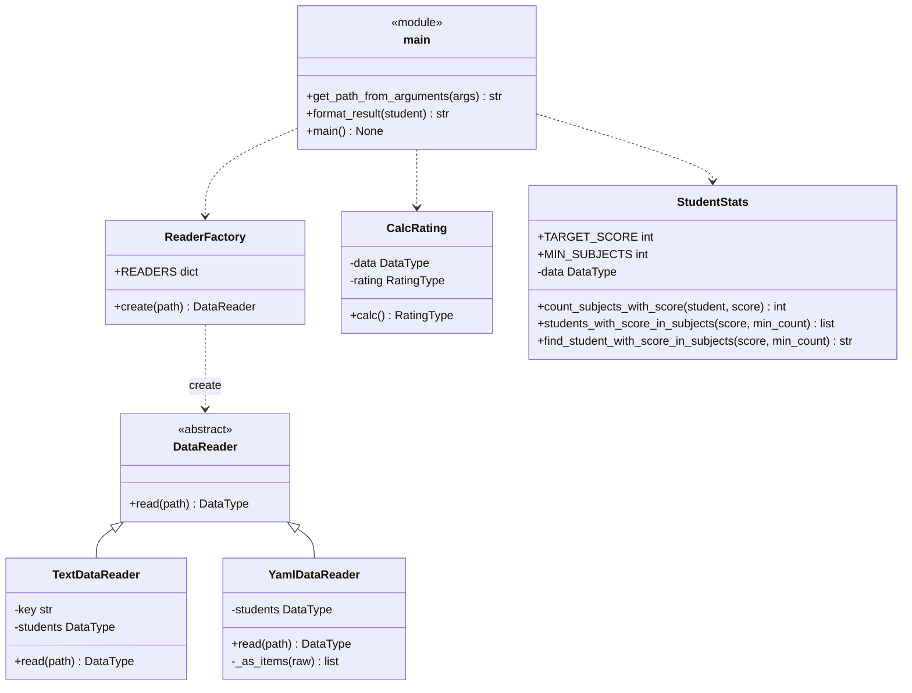
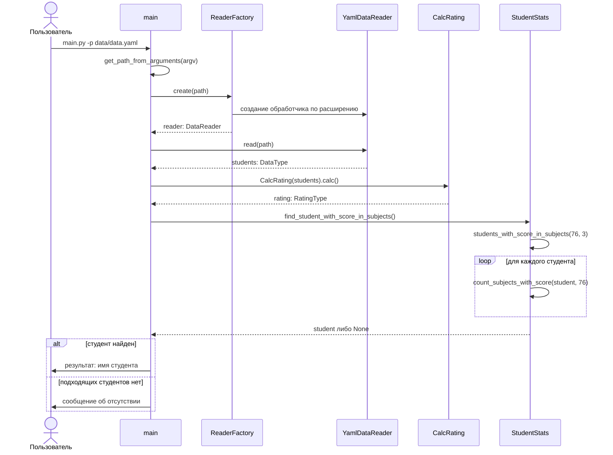

# Лабораторная работа № 1 по дисциплине «Технологии программирования»

**Знакомство с системой контроля версий Git и инструментом CI/CD GitHub Actions**

> **Индивидуальный вариант 6.** Формат входного файла — **YAML**.
> Расчётная процедура — определить и вывести на экран студента, имеющего
> **76 баллов минимум по трём дисциплинам**. Если таких студентов несколько,
> выводится любой из них; если таких студентов нет, выводится сообщение об их
> отсутствии.

---

## Постановка задачи

1. Освоить распределённую систему контроля версий Git и её основные операции:
   создание репозитория, индексирование, фиксация изменений, ветвление и слияние.
2. Освоить понятия непрерывной интеграции (CI) и непрерывного развёртывания (CD)
   и настроить автоматизированное тестирование проекта средствами GitHub Actions.
3. Разработать объектно-ориентированную программу на Python 3, рассчитывающую
   средний рейтинг студентов по дисциплинам, и покрыть её модульными тестами.
4. Выполнить индивидуальное задание варианта 6: добавить наследника класса
   `DataReader`, обрабатывающего файлы формата YAML, и класс расчёта
   характеристик студентов, разработав каждый из них в отдельной ветке кода.

## Краткое описание проекта

Программа читает список студентов и полученных ими оценок из файла, рассчитывает
средний рейтинг каждого студента и выполняет расчётную процедуру
индивидуального варианта.

Чтение входных данных отделено от расчётов: абстрактный класс `DataReader`
задаёт единый интерфейс `read(path) -> DataType`, а конкретные обработчики
реализуют его для своего формата — `TextDataReader` для исходного текстового
формата и `YamlDataReader` для формата варианта. Класс `ReaderFactory`
подбирает обработчик по расширению файла, поэтому программа принимает файлы
обоих форматов, а добавление третьего не потребует изменений ни в расчётных
классах, ни в точке входа.

Расчёты разделены на два класса: `CalcRating` вычисляет средний балл каждого
студента, `StudentStats` реализует процедуру варианта — поиск студентов,
набравших заданный балл минимум по указанному числу дисциплин.

### Структура проекта

```
lab_1
|----.github
|       |----workflows
|          |----github-actions-testing.yml   рабочий процесс GitHub Actions
|
|----data
|       |----data.txt                        исходный текстовый формат
|       |----data.yaml                       те же данные в формате варианта
|
|----src
|       |----Types.py                        псевдонимы типов
|       |----DataReader.py                   абстрактный обработчик
|       |----TextDataReader.py               обработчик формата TXT
|       |----YamlDataReader.py               обработчик формата YAML
|       |----ReaderFactory.py                выбор обработчика по расширению
|       |----CalcRating.py                   расчёт среднего рейтинга
|       |----StudentStats.py                 процедура варианта 6
|       |----main.py                         точка входа
|
|----test                                    модульные тесты (50 штук)
|----conftest.py                             настройка путей импорта
|----requirements.txt
|----.gitignore
|----LICENSE
|----README.md
```

## Используемые языки, библиотеки и технологии

| Технология | Назначение |
|---|---|
| Python 3.10+ | язык реализации; аннотации типов (Type Hints) |
| `abc` | абстрактный базовый класс `DataReader` |
| `PyYAML` | разбор входного файла формата YAML |
| `argparse` | разбор аргументов командной строки |
| `pytest` | модульное тестирование, фикстуры, параметризация |
| `pycodestyle` | проверка соответствия кода стандарту PEP 8 |
| Git | распределённая система контроля версий |
| GitHub Actions | непрерывная интеграция: линтер и тесты на каждый push |

## Форматы входных данных

Один и тот же набор из семи студентов записан в каталоге `data/` в двух
форматах — исходном текстовом и YAML по варианту. Обработчик выбирается по
расширению файла автоматически.

<table>
<tr><th>TXT — исходный формат</th><th>YAML — формат варианта 6</th></tr>
<tr><td>

```
Иванов Иван Иванович
    математика:67
    литература:100
```

</td><td>

```yaml
Иванов Иван Иванович:
  математика: 67
  литература: 100
```

</td></tr>
</table>

`YamlDataReader` принимает обе допустимые записи — отображение (как в примере
выше) и последовательность из одноключевых отображений, приведённую в
методических указаниях:

```yaml
- Иванов Иван Иванович:
    математика: 67
    литература: 100
```

## Индивидуальное задание: вариант 6

Расчётную процедуру реализует класс `StudentStats`. Параметры варианта вынесены
в константы класса, поэтому условие читается прямо в коде:

```python
class StudentStats:
    TARGET_SCORE = 76
    MIN_SUBJECTS = 3
```

| Метод | Назначение |
|---|---|
| `count_subjects_with_score(student, score)` | число дисциплин студента с заданным баллом |
| `students_with_score_in_subjects(score, min_count)` | все студенты, у которых балл `score` встречается не менее `min_count` раз |
| `find_student_with_score_in_subjects(score, min_count)` | первый подходящий студент либо `None`, если таких нет |

Условие варианта допускает любого из подходящих студентов. Возвращается первый
по порядку следования во входном файле — так результат работы программы
воспроизводим и его можно проверить тестом. Случай, когда подходящих студентов
нет, обрабатывается отдельно: `find_student_with_score_in_subjects` возвращает
`None`, а функция `format_result` в `src/main.py` печатает сообщение об
отсутствии таких студентов.

## Запуск

```powershell
# 1. Виртуальное окружение и зависимости
conda create -n tplab1-env python=3.10
conda activate tplab1-env
pip install -r requirements.txt

# 2. Проверка стиля кода
pycodestyle src test conftest.py

# 3. Модульные тесты
pytest test

# 4. Запуск программы на файле формата варианта
python src/main.py -p data/data.yaml

# 5. Программа принимает и исходный текстовый формат
python src/main.py -p data/data.txt
```

Переменную `PYTHONPATH` устанавливать не нужно: пути импорта настраивает файл
`conftest.py`. Если запускать тесты без него, разделителем путей в Windows
служит точка с запятой — `$env:PYTHONPATH = "./;./src"`, тогда как в
методических указаниях приведён вариант для UNIX-систем (`"./:./src"`).

Вывод программы:

```
Students:  {'Абрамов Петр Сергеевич': [('математика', 80), ...], ...}
Rating:  {'Абрамов Петр Сергеевич': 85.33333333333333, ...}
Студент, имеющий 76 баллов минимум по 3 дисциплинам: Морозова Елена Игоревна
```

## Непрерывная интеграция

Рабочий процесс [`github-actions-testing.yml`](.github/workflows/github-actions-testing.yml)
запускается на каждый push в ветку `main` и на каждый запрос слияния с ней.
Сборка выполняется на `ubuntu-latest` с Python 3.10 и состоит из пяти шагов:
клонирование репозитория, установка интерпретатора, установка зависимостей,
проверка стиля `pycodestyle` и запуск `pytest`. Ненулевой код возврата любого
шага помечает сборку как проваленную.

## Диаграммы

Методические указания требуют привести в отчёте UML-диаграммы проекта. Их
две: **диаграмма классов** показывает структуру — какие классы есть и как они
связаны, **диаграмма последовательности** показывает поведение — в каком
порядке объекты вызывают друг друга при одном запуске программы. Обе
приведены ниже и отрисовываются прямо на этой странице, отдельные файлы
изображений для этого не нужны.

### Рисунок 1 — диаграмма классов



### Рисунок 2 — диаграмма последовательности



## Модульное тестирование

Тестами покрыты все классы проекта — 50 тестов в шести файлах:

* разбор обоих форматов: корректные данные, обе допустимые записи YAML, файлы
  проекта, пустые и повреждённые файлы, нарушения структуры документа;
* выбор обработчика по расширению, включая отказ на неподдерживаемом формате;
* расчёт среднего рейтинга, в том числе на одной дисциплине и пустых данных;
* процедура варианта: подсчёт дисциплин с заданным баллом, отбор студентов при
  разных значениях порога, граничные случаи (студент без дисциплин, пустая
  выборка, отсутствие подходящих студентов, неположительное число дисциплин);
* разбор аргументов командной строки, формирование сообщения о результате и
  сквозной запуск программы на обоих форматах.

## Лицензия

Проект распространяется на условиях лицензии MIT — см. файл [LICENSE](LICENSE).
